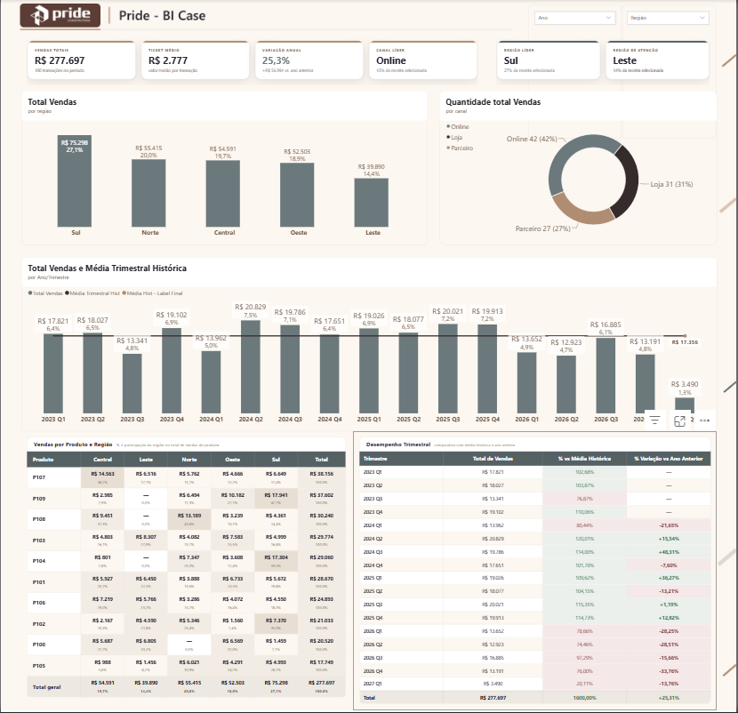
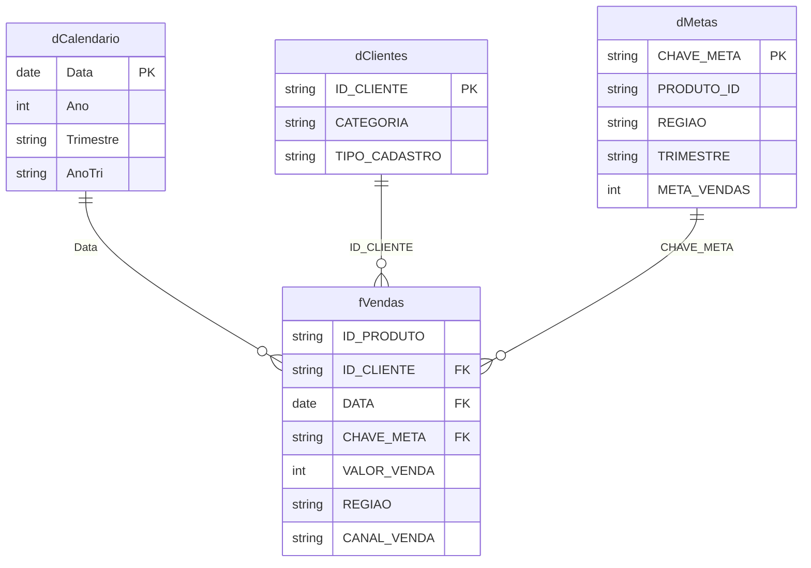

# Case analítico em Power BI: vendas, metas e qualidade de dados

> Projeto não oficial desenvolvido com dados sinteticos para demonstrar
> modelagem, transformação, DAX e apresentação de informações no Power BI.



## Objetivo

O projeto organiza vendas, clientes, metas e calendário para responder quatro
perguntas:

1. Como receita, volume e ticket evoluíram?
2. Quais regiões, canais e produtos explicam as diferenças?
3. A base de metas permite medir desempenho de forma confiável?
4. Quais problemas de qualidade podem alterar a interpretação dos indicadores?

Os resultados são tratados como evidências para investigação. As causas
comerciais permanecem hipóteses até serem reconciliadas com dados operacionais
e contexto de negócio.

## Decisoes tecnicas

| Decisão | Motivo | Ganho |
|---|---|---|
| PBIP/TMDL/PBIR como estrutura versionável | Permitir revisão do modelo e dos visuais sem depender somente do PBIX | Auditoria de medidas, relacionamentos e configurações |
| Tabela `Medidas` desconectada | Centralizar 39 medidas DAX por pasta funcional | Localização e reutilização mais simples |
| `dCalendario` com `AnoTri` | Padronizar filtros e comparações trimestrais | Leitura temporal consistente |
| `CHAVE_META` composta | A origem de metas não possui uma chave comum com vendas | Associação por produto, região e trimestre |
| Consolidação de clientes duplicados e inclusão de IDs órfãos | Evitar perda de receita ao relacionar vendas e clientes | Preservação dos valores e exposição do problema cadastral |
| HTML Content para cards e tabelas densas | Controlar hierarquia visual e conteúdo no espaço disponível | Layout consistente para KPIs, matriz e tabela trimestral |
| Interações protegidas para benchmarks | Evitar que alguns filtros alterem cards e comparativos globais | Referências estáveis durante a exploração regional |

## Modelo de dados

O diagrama abaixo representa o modelo lógico usado para organizar a análise.
`Medidas` é uma tabela técnica desconectada.



### Estado atual do modelo

O modelo físico foi mantido sem alterações nesta entrega:

- 7 tabelas, incluindo duas tabelas automáticas de data;
- 4 relacionamentos ativos;
- 3 relacionamentos bidirecionais;
- relação `dCalendario[Data]` para `fVendas[DATA]` configurada como um para um;
- data/hora automática ativada;
- consultas M centralizadas no parâmetro `local_do_arquivo`;
- 39 medidas DAX.

O inventário completo está em
[docs/modelo-power-bi.md](docs/modelo-power-bi.md).

## Hipoteses para validacao

### 1. Metas incompletas

**Evidência:** existem 5 metas para 50 combinações possíveis de produto e
região, cobertura de 10%. Somente R$ 8.893, ou 3,2% da receita, está associado
a chaves que possuem meta.

**Hipótese:** o arquivo representa uma amostra ou um planejamento incompleto,
e não o universo oficial de metas.

**Validação:** confirmar responsável, vigência, granularidade, regra de
recorrência e ausência do ano.

**Ação possível:** reconstruir a base no grão
ano-produto-região-trimestre e criar controle de completude antes da carga.

**Resultado esperado:** atingimento comparável entre períodos e menos
combinações sem referência.

### 2. Queda de receita em 2026

**Evidência:** a receita caiu de R$ 77.037 em 2025 para R$ 56.651 em 2026,
redução de 26,5%. As transações caíram 4%, enquanto o ticket médio caiu 23,4%.
Oeste reduziu R$ 22.433 e Loja reduziu R$ 18.142. Norte cresceu R$ 11.450 e
Parceiro cresceu R$ 4.739, compensando parcialmente as perdas.

**Hipótese:** a queda está mais associada a mix, ticket e concentração em
região/canal do que somente à quantidade de vendas.

**Validação:** decompor por mês, produto e cliente; verificar completude de
2026; revisar preço, desconto, disponibilidade e cobertura comercial.

**Ação possível:** priorizar o diagnóstico de Oeste e Loja e comparar suas
práticas com Norte e Parceiro.

**Resultado esperado:** identificar alavancas específicas para recuperar
ticket e receita, evitando uma ação uniforme para todos os segmentos.

### 3. Cadastro de clientes

**Evidência:** quatro IDs sem cadastro representam 40 transações, R$ 109.370 e
39,4% da receita. Três IDs duplicados estão ligados a R$ 77.104, ou 27,8% da
receita.

**Hipótese:** as bases de vendas e clientes usam cadastros com cobertura e
unicidade diferentes.

**Validação:** reconciliar IDs com a origem cadastral e confirmar qual registro
é válido para cada duplicidade.

**Ação possível:** aplicar validação de chave única, quarentena de órfãos e
rotina de reconciliação antes da atualização do dashboard.

**Resultado esperado:** maior confiabilidade nas análises de perfil, região e
aquisição de clientes.

### 4. Periodos incompletos

**Evidência:** 2027 possui apenas duas transações, entre 10 e 25 de janeiro,
totalizando R$ 3.490.

**Hipótese:** o valor representa carga parcial, não deterioração anual.

**Validação:** conferir a data de corte e comparar somente períodos equivalentes.

**Ação possível:** sinalizar períodos abertos e removê-los de comparações
anuais fechadas.

**Resultado esperado:** redução de alertas falsos e comparações temporais
coerentes.

### 5. Contexto da variacao anual

**Evidência:** o card padrão mostra variação anual de 25,3% com vários anos
selecionados, enquanto a comparação direta entre 2025 e 2026 é de -26,5%.

**Hipótese:** o card pode ser interpretado como resultado de um ano específico
mesmo quando o contexto contém vários anos.

**Validação:** testar a medida com um único ano e com intervalos de múltiplos
anos, reconciliando o período deslocado pelo `DATEADD`.

**Ação possível:** exigir seleção de ano ou incluir no card o período comparado.

**Resultado esperado:** evitar decisões baseadas em uma comparação temporal
ambígua.

## Indicadores e visuais

- Receita, quantidade de vendas, ticket médio e variação anual;
- região líder e região de atenção;
- receita e participação por região;
- quantidade de transações por canal;
- evolução trimestral contra média histórica;
- matriz de produto por região;
- tabela trimestral com comparação anual;
- filtros de ano e região.

## Como executar

1. Clone o repositório.
2. Abra `case-bi-construtora-pride.pbip` no Power BI Desktop.
3. Acesse **Transformar dados > Gerenciar parâmetros**.
4. Altere o valor de `local_do_arquivo` para a pasta local em que o repositório
   foi clonado. O valor deve terminar com uma barra invertida (`\`), por
   exemplo: `C:\Projetos\case-bi-construtora-pride\`.
5. O parâmetro é concatenado com o nome de cada planilha nas consultas, como
   em `local_do_arquivo & "Base_Vendas_Detalhada.xlsx"`. Dessa forma, uma única
   alteração atualiza a pasta usada pelas fontes de vendas, clientes e metas.
6. Confirme que as três planilhas `Base_*.xlsx` estão na raiz dessa pasta.
7. Atualize o modelo.
8. Confirme a disponibilidade dos visuais HTML Content e Smart Filter Pro.

## Estrutura do repositorio

```text
.
|-- assets/                                  # Capturas e recursos visuais
|-- case-bi-construtora-pride.Report/        # Definição PBIR do relatório
|-- case-bi-construtora-pride.SemanticModel/ # Modelo TMDL
|-- docs/                                    # Documentação técnica
|-- tests/                                   # Validação do repositório
|-- Base_*.xlsx                              # Dados sintéticos
|-- case-bi-construtora-pride.pbip           # Projeto Power BI
|-- case-bi-construtora-pride.pbix           # Arquivo consolidado
`-- case-bi-construtora-pride.pdf            # Exportação do dashboard
```

## Limitacoes conhecidas

- O parâmetro `local_do_arquivo` precisa ser ajustado para a pasta local do
  repositório antes da primeira atualização em outra máquina.
- O relatório mantém tabelas automáticas de data e relacionamentos
  bidirecionais.
- A base de metas não possui ano e cobre somente 10% das combinações.
- A média trimestral histórica usa divisor fixo de 16.
- 2027 é um período parcial.
- O relatório depende de dois visuais personalizados.
- Antes de atualizar os dados, confirme que `local_do_arquivo` aponta para uma
  pasta que contém as três planilhas da raiz do repositório.

## Documentacao tecnica

- [Modelo, tabelas, medidas e visuais](docs/modelo-power-bi.md)
- [Roteiro objetivo de apresentação](APRESENTACAO_DASHBOARD.md)

## Licenca

Código e bases sintéticas distribuídos sob a licença MIT. Consulte
[LICENSE](LICENSE).
