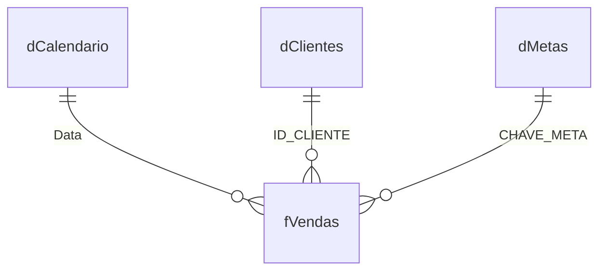

# Modelo Power BI

## Escopo

Este documento registra o modelo semântico e o relatório no estado atual do
repositório. O inventário foi conferido nos arquivos TMDL/PBIR e no modelo
aberto pelo Power BI Modeling MCP em 12 de junho de 2026.

Resumo do inventário:

- 7 tabelas físicas no modelo;
- 48 colunas no total;
- 39 medidas DAX na tabela `Medidas`;
- 4 relacionamentos ativos;
- 9 visuais na página do relatório;
- 2 visuais personalizados: HTML Content e Smart Filter Pro.

As três planilhas de origem usam dados sintéticos:

| Arquivo | Uso |
|---|---|
| `Base_Vendas_Detalhada.xlsx` | Transações de vendas |
| `Base_Clientes_Detalhada.xlsx` | Cadastro e qualidade de clientes |
| `Base_Metas.xlsx` | Metas por produto, região e trimestre |

## Estado atual do modelo

O modelo possui uma estrutura lógica próxima de um modelo estrela, com
`fVendas` no centro e dimensões de calendário, clientes e metas. A estrutura
física atual, entretanto, também mantém duas tabelas automáticas de data e
quatro relacionamentos:

| Origem | Destino | Cardinalidade | Filtro |
|---|---|---|---|
| `fVendas[DATA]` | `LocalDateTable...[Date]` | Muitos para um | Unidirecional |
| `fVendas[ID_CLIENTE]` | `dClientes[ID_CLIENTE]` | Muitos para um | Bidirecional |
| `fVendas[CHAVE_META]` | `dMetas[CHAVE_META]` | Muitos para um | Bidirecional |
| `dCalendario[Data]` | `fVendas[DATA]` | Um para um | Bidirecional |

O recurso de data/hora automática está ativo. Por isso, o modelo contém:

- `DateTableTemplate_f07a36fe-a879-4bb0-9f89-0436de75f486`;
- `LocalDateTable_c0dc44ec-6ecb-422a-8114-a4c92dfc53ca`.

## Modelo lógico

O diagrama representa a leitura analítica pretendida. Para reproduzir a
estrutura física exata, devem ser consideradas as tabelas automáticas e as
cardinalidades descritas na seção anterior.

## Tabelas

### fVendas

Grão: uma linha por transação.

| Coluna | Tipo | Uso |
|---|---|---|
| `ID_PRODUTO` | Texto | Produto vendido |
| `ID_CLIENTE` | Texto | Chave de cliente |
| `DATA` | Data | Data da transação |
| `VALOR_VENDA` | Inteiro | Receita da transação |
| `REGIÃO` | Texto | Região comercial |
| `CANAL_VENDA` | Texto | Canal da venda |
| `TRIMESTRE` | Texto | Trimestre derivado no formato `Q1` a `Q4` |
| `ANO` | Inteiro | Ano derivado da data |
| `CHAVE_META` | Texto | Produto, região e trimestre concatenados |

Transformações principais: tipagem, criação de trimestre e ano, e construção
de `CHAVE_META`.

### dClientes

Grão: uma linha consolidada por `ID_CLIENTE`.

| Coluna | Tipo | Uso |
|---|---|---|
| `ID_CLIENTE` | Texto | Chave da dimensão |
| `NOME_CLIENTE` | Texto | Nome ou nomes consolidados |
| `CATEGORIA` | Texto | Categoria cadastral |
| `REGIÃO` | Texto | Região do cadastro |
| `CANAL DE AQUISIÇÃO` | Texto | Origem do cliente |
| `QTD_CADASTROS` | Texto no modelo | Quantidade de registros de origem |
| `TIPO_CADASTRO` | Texto | `OK`, `Duplicado` ou `Não identificado` |

Transformações principais: tradução de regiões, agrupamento de duplicidades,
marcação de qualidade e inclusão de quatro IDs órfãos para preservar a receita
nas análises.

### dMetas

Grão: produto, região e trimestre. A origem não contém ano.

| Coluna | Tipo | Uso |
|---|---|---|
| `PRODUTO_ID` | Texto | Produto da meta |
| `META_VENDAS` | Inteiro | Valor da meta |
| `REGIÃO` | Texto | Região da meta |
| `TRIMESTRE` | Texto | Trimestre convertido de `Tn` para `Qn` |
| `CHAVE_META` | Texto | Chave de relacionamento com vendas |

As cinco linhas são tratadas como metas recorrentes para todos os anos
selecionados. Essa regra deve ser validada antes de usar o atingimento como
indicador de gestão.

### dCalendario

Calendário contínuo entre a menor e a maior data de `fVendas`.

Colunas: `Data`, `Ano`, `Mês Nº`, `Mês`, `Mês Abrev`, `Ano Mês`,
`Trimestre`, `AnoTri`, `Dia`, `Dia Semana Nº`, `Dia Semana` e
`Fim de Semana`.

### Medidas

Tabela técnica desconectada, criada para centralizar as medidas DAX. Possui
uma coluna oculta e 39 medidas organizadas em pastas.

### Tabelas automáticas de data

As tabelas `DateTableTemplate...` e `LocalDateTable...` são geradas pelo
recurso de data/hora automática do Power BI. Elas não são dimensões de negócio,
mas fazem parte do modelo atual.

## Medidas DAX

As fórmulas completas estão em
`case-bi-construtora-pride.SemanticModel/definition/tables/Medidas.tmdl`.
Medidas HTML são descritas pelo resultado produzido, evitando duplicar no
Markdown centenas de linhas de CSS e HTML.

### Total Vendas

- **Pasta:** Vendas
- **Formato:** `R$ #,##0`
- **Finalidade:** soma `fVendas[VALOR_VENDA]` no contexto atual.
- **DAX:** `SUM(fVendas[VALOR_VENDA])`

### Total Meta

- **Pasta:** Metas
- **Formato:** `R$ #,##0`
- **Finalidade:** soma as metas visíveis.
- **DAX:** `SUM(dMetas[META_VENDAS])`

### % Atingimento

- **Pasta:** Metas
- **Formato:** `0.00%`
- **Finalidade:** divide vendas pela meta disponível.
- **DAX:** `DIVIDE([Total Vendas], [Total Meta])`

### Qtd Vendas

- **Pasta:** Vendas
- **Formato:** `#,##0`
- **Finalidade:** conta transações.
- **DAX:** `COUNTROWS(fVendas)`

### Ticket Médio

- **Pasta:** Vendas
- **Formato:** `R$ #,##0.00`
- **Finalidade:** calcula o valor médio por transação.
- **DAX:** `AVERAGE(fVendas[VALOR_VENDA])`

### Cobertura de Metas

- **Pasta:** Metas
- **Formato:** `0.00%`
- **Finalidade:** compara as linhas de meta com 50 combinações de produto e região.
- **DAX:** `DIVIDE(COUNTROWS(dMetas), 50)`

### Vendas LY

- **Pasta:** Inteligência de Tempo
- **Formato:** `R$ #,##0`
- **Finalidade:** desloca o contexto um ano para trás com `DATEADD`.

### Média Trimestral Hist

- **Pasta:** Inteligência de Tempo
- **Formato:** `R$ #,##0.00`
- **Finalidade:** divide as vendas sem filtro de calendário por 16 trimestres.
- **Observação:** o denominador é fixo e pressupõe os 16 trimestres completos de 2023 a 2026.

### % vs Média Hist

- **Pasta:** Inteligência de Tempo
- **Formato:** `0.00%`
- **Finalidade:** expressa vendas como proporção da média trimestral histórica.

### % Receita Não Identificada

- **Pasta:** Qualidade de Dados
- **Formato:** `0.00%`
- **Finalidade:** mede a participação de clientes classificados como não identificados.

### Variação vs LY

- **Pasta:** Inteligência de Tempo
- **Formato:** moeda com negativos em vermelho
- **Finalidade:** calcula a diferença absoluta para o período do ano anterior.

### % Variação vs LY

- **Pasta:** Inteligência de Tempo
- **Formato:** percentual com negativos em vermelho
- **Finalidade:** calcula a variação percentual para o período do ano anterior.

### % Receita

- **Pasta:** Participação
- **Formato:** `0.0%`
- **Finalidade:** divide a receita do contexto pela receita sem filtros em `fVendas`.

### Gap Meta R$

- **Pasta:** Metas
- **Formato:** moeda
- **Finalidade:** calcula `Total Meta - Total Vendas`.

### % Gap Meta

- **Pasta:** Metas
- **Formato:** percentual
- **Finalidade:** expressa o gap como proporção da meta.

### Receita Não Identificada R$

- **Pasta:** Qualidade de Dados
- **Formato:** `R$ #,##0`
- **Finalidade:** retorna a receita absoluta de clientes não identificados.

### Rank Produto

- **Pasta:** Rankings
- **Formato:** inteiro
- **Finalidade:** classifica produtos por receita com ranking denso.

### Rank Região

- **Pasta:** Rankings
- **Formato:** inteiro
- **Finalidade:** classifica regiões por receita com ranking denso.

### Canal Líder

- **Pasta:** Destaques
- **Finalidade:** retorna o canal com maior receita no contexto.

### % Receita Canal Líder

- **Pasta:** Destaques
- **Formato:** `0.00%`
- **Finalidade:** calcula a participação do canal líder.

### Região Líder

- **Pasta:** Destaques
- **Finalidade:** retorna a região com maior receita.

### % Receita Região Líder

- **Pasta:** Destaques
- **Formato:** `0.00%`
- **Finalidade:** calcula a participação da região líder.

### Região Atenção

- **Pasta:** Destaques
- **Finalidade:** retorna a região com menor receita no contexto.

### % Receita Região Atenção

- **Pasta:** Destaques
- **Formato:** `0.00%`
- **Finalidade:** calcula a participação da região de menor receita.

### Total Vendas Região Líder

- **Pasta:** Destaques
- **Formato:** `R$ #,##0`
- **Finalidade:** retorna a receita da região líder.

### Total Vendas Região Atenção

- **Pasta:** Destaques
- **Formato:** `R$ #,##0`
- **Finalidade:** retorna a receita da região de atenção.

### Total Vendas Canal Líder

- **Pasta:** Destaques
- **Formato:** `R$ #,##0`
- **Finalidade:** retorna a receita do canal líder.

### Qtd Vendas Região Atenção

- **Pasta:** Destaques
- **Formato:** inteiro
- **Finalidade:** conta transações da região de atenção.

### Média Hist - Label Final

- **Pasta:** Inteligência de Tempo
- **Formato:** `R$ #,##0`
- **Finalidade:** exibe a média histórica somente no último ponto do eixo.

### HTML Cards Executivos

- **Pasta:** Destaques
- **Finalidade:** renderiza receita, ticket, variação anual e canal líder em uma faixa HTML.
- **Dependência:** visual HTML Content.

### HTML Cards Regioes

- **Pasta:** Destaques
- **Finalidade:** renderiza região líder e região de atenção em HTML.
- **Dependência:** visual HTML Content.

### HTML Vendas Produto Regiao

- **Pasta:** Participação
- **Finalidade:** gera a matriz HTML de produto por região, com receita e participação.
- **Dependência:** visual HTML Content.

### Linha Farol

- **Pasta:** Metas
- **Formato:** inteiro
- **Finalidade:** mantém combinações no conjunto de dados quando o atingimento está vazio.

### Vendas Metas Oficiais

- **Pasta:** Metas
- **Formato:** `R$ #,##0`
- **Finalidade:** restringe vendas às chaves existentes em `dMetas`.

### Valor Metas Ciclos

- **Pasta:** Metas
- **Formato:** `R$ #,##0`
- **Finalidade:** multiplica a meta-base pela quantidade de anos selecionados.

### % Execução Metas Oficiais

- **Pasta:** Metas
- **Formato:** `0.0%`
- **Finalidade:** divide vendas vinculadas por metas recorrentes.

### Combinações Meta com Venda

- **Pasta:** Metas
- **Formato:** inteiro
- **Finalidade:** conta chaves de meta que possuem vendas.

### HTML Controle Metas

- **Pasta:** Metas
- **Finalidade:** gera uma visão HTML de cobertura e execução das metas.
- **Estado no relatório:** medida existente, sem visual ativo na página atual.

### HTML Tabela Trimestral

- **Pasta:** Inteligência de Tempo
- **Finalidade:** gera a tabela trimestral com vendas, média histórica e variação anual.
- **Dependência:** visual HTML Content.

## Visuais do relatório

| ID | Tipo | Campos ou medidas | Objetivo |
|---|---|---|---|
| `8ea21b49662a4d58a8d1` | HTML Content | `HTML Cards Executivos` | KPIs de performance |
| `c9e1f4a2b3d5067891ab` | HTML Content | `HTML Cards Regioes` | Destaques regionais |
| `ae39f2b835ab32a1d092` | Colunas | `REGIÃO`, `Total Vendas` | Receita e participação por região |
| `1f8e4700b7d9101d683a` | Rosca | `CANAL_VENDA`, `Qtd Vendas` | Volume por canal |
| `3bf3d02da0a5c6c25019` | Coluna e linha | `AnoTri`, vendas e média histórica | Evolução trimestral |
| `a50db6ca0c6445255352` | HTML Content | `HTML Vendas Produto Regiao` | Matriz produto por região |
| `26a2d7a119062d88b108` | HTML Content | `HTML Tabela Trimestral` | Comparativo trimestral |
| `d94cdba159ca98baede8` | Smart Filter Pro | `dCalendario[Ano]` | Filtro de ano |
| `3b65c806b57a59dae6e7` | Smart Filter Pro | `fVendas[REGIÃO]` | Filtro de região |

O filtro de região está configurado para não afetar os cards executivos, os
cards regionais e a tabela trimestral. Gráfico de região e canal também não
alteram os cards executivos; o gráfico regional não altera a tabela trimestral.
Essas interações mantêm benchmarks globais enquanto outros visuais são
explorados.

## Limitações conhecidas

1. **Caminhos locais:** as três consultas M usam caminhos absolutos da máquina
   de desenvolvimento. O modelo atual não é portátil sem editar as fontes.
2. **Data/hora automática:** duas tabelas automáticas coexistem com
   `dCalendario`.
3. **Relacionamentos:** três dos quatro relacionamentos são bidirecionais e a
   relação entre `dCalendario` e `fVendas` está como um para um.
4. **Metas sem ano:** as metas são repetidas para cada ano selecionado.
5. **Cobertura de metas:** apenas 5 de 50 combinações produto-região possuem
   meta.
6. **Média histórica fixa:** a medida usa divisor 16 e deve ser revista quando
   novos trimestres completos forem incorporados.
7. **Tooltip da média histórica:** a tabela HTML reconstrói o valor-base usando
   `1 + [% vs Média Hist]`, embora a medida represente uma razão. O valor do
   tooltip deve ser reconciliado antes de ser usado como referência.
8. **Tema duplicado:** o arquivo de tema na raiz e o tema incorporado no
   relatório possuem ordem de cores diferente; o relatório usa a versão em
   `SharedResources/CustomThemes`.
9. **Período parcial:** 2027 contém somente duas transações entre 10 e 25 de
   janeiro.
10. **Visuais personalizados:** HTML Content e Smart Filter Pro precisam estar
   disponíveis no Power BI Desktop ou Service.

## Manutenção

- Atualizar as planilhas mantendo nomes e colunas.
- Revisar o divisor da média histórica quando o período-base mudar.
- Validar metas antes de interpretar atingimento.
- Executar `tests/validate-public-case.ps1` após mudanças em TMDL ou PBIR.
- Revisar os caminhos das fontes e metadados antes de tornar o repositório
  público.
