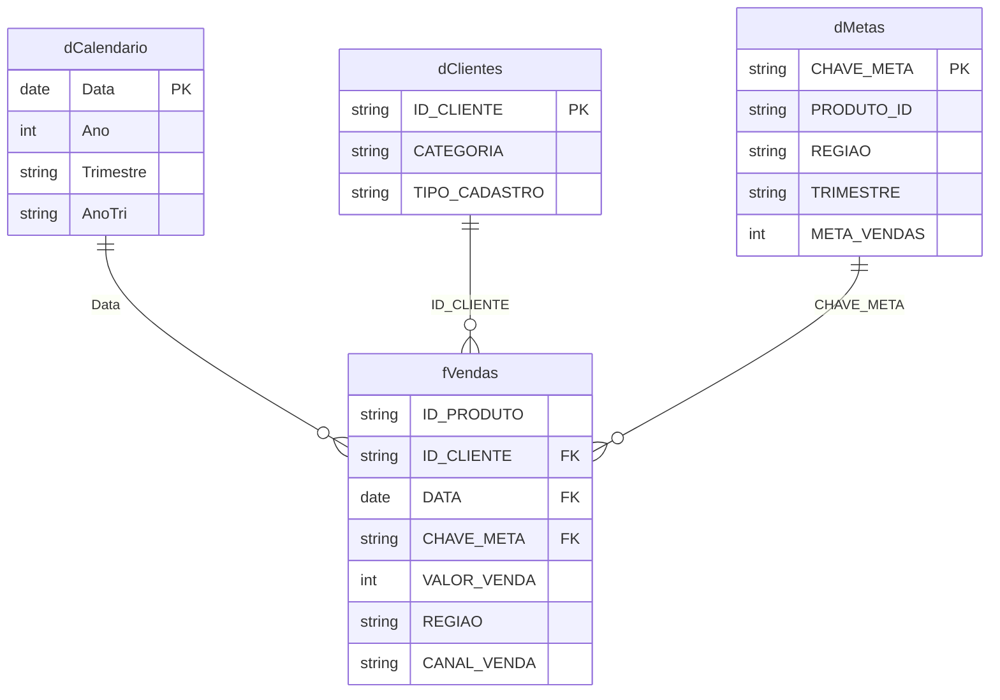

# Case Power BI Publico Implementation Plan

> **Atualização de escopo em 12/06/2026:** por decisão do usuário, a Task 3
> não deve alterar o modelo semântico. O modelo deve ser documentado exatamente
> no estado atual, incluindo caminhos locais, tabelas automáticas de data,
> cardinalidades e filtros bidirecionais. A portabilidade passa a ser uma
> limitação conhecida antes da futura publicação.

> **For agentic workers:** REQUIRED SUB-SKILL: Use superpowers:subagent-driven-development (recommended) or superpowers:executing-plans to implement this plan task-by-task. Steps use checkbox (`- [ ]`) syntax for tracking.

**Goal:** Transformar o repositorio em um case analitico documentado, portatil e preparado para futura publicacao, preservando e enviando as alteracoes atuais do dashboard.

**Architecture:** O PBIP sera a fonte versionavel do relatorio e do modelo semantico. O modelo ativo no Power BI Desktop sera corrigido pelo Power BI Modeling MCP, salvo nos arquivos TMDL e reconciliado com o PBIX. O README apresentara decisoes, hipoteses e acoes; `docs/modelo-power-bi.md` mantera o catalogo tecnico detalhado.

**Tech Stack:** Power BI Desktop, PBIP/TMDL/PBIR, Power Query M, DAX, Power BI Modeling MCP, PowerShell, Git e GitHub CLI.

---

## Estrutura de arquivos

**Criar**

- `tests/validate-public-case.ps1`: contrato automatizado para README, documentacao, modelo, JSON, arquivos locais e links.
- `docs/modelo-power-bi.md`: catalogo tecnico das tabelas, relacionamentos, medidas e visuais.
- `assets/dashboard-overview.png`: captura real do dashboard final.
- `LICENSE`: licenca MIT para o codigo e os dados sinteticos distribuidos no repositorio.

**Modificar**

- `README.md`: pagina principal do case orientada a decisoes.
- `.gitignore`: caches, configuracoes locais e arquivos pessoais.
- `case-bi-construtora-pride.SemanticModel/definition/model.tmdl`: parametro, ordem das consultas e desativacao de data/hora automatica.
- `case-bi-construtora-pride.SemanticModel/definition/expressions.tmdl`: parametro `PastaFontes`.
- `case-bi-construtora-pride.SemanticModel/definition/relationships.tmdl`: tres relacionamentos `1:*` unidirecionais.
- `case-bi-construtora-pride.SemanticModel/definition/tables/fVendas.tmdl`: fonte baseada em `PastaFontes`.
- `case-bi-construtora-pride.SemanticModel/definition/tables/dClientes.tmdl`: fonte baseada em `PastaFontes`.
- `case-bi-construtora-pride.SemanticModel/definition/tables/dMetas.tmdl`: fonte baseada em `PastaFontes`.
- `case-bi-construtora-pride.SemanticModel/definition/tables/dCalendario.tmdl`: tabela de datas oficial.
- `case-bi-construtora-pride.pbix`: copia binaria sincronizada com o PBIP final.

**Remover do indice, mantendo local quando necessario**

- `case-bi-construtora-pride.Report/.pbi/localSettings.json`
- `case-bi-construtora-pride.SemanticModel/.pbi/cache.abf`
- `case-bi-construtora-pride.SemanticModel/.pbi/editorSettings.json`
- `case-bi-construtora-pride.SemanticModel/.pbi/localSettings.json`
- `.claude/settings.local.json`

**Preservar e revisar antes de incluir**

- alteracoes atuais em `case-bi-construtora-pride.Report/**`;
- alteracoes atuais em `case-bi-construtora-pride.SemanticModel/definition/tables/Medidas.tmdl`;
- `bi-construtura-pride-tema.json`;
- `APRESENTACAO_DASHBOARD.md`;
- `assets/pride-bi-case-background.*`;
- exclusoes locais de prototipos, planos antigos e testes substituidos.

---

### Task 1: Criar o contrato de validacao

**Files:**
- Create: `tests/validate-public-case.ps1`
- Test: `tests/validate-public-case.ps1`

- [ ] **Step 1: Criar o teste inicialmente falho**

Criar o script com as verificacoes abaixo:

```powershell
$ErrorActionPreference = "Stop"
$root = Split-Path -Parent $PSScriptRoot

function Assert-True {
    param([bool]$Condition, [string]$Message)
    if (-not $Condition) { throw $Message }
}

$readme = Join-Path $root "README.md"
$docs = Join-Path $root "docs/modelo-power-bi.md"
$modelDir = Join-Path $root "case-bi-construtora-pride.SemanticModel/definition"

Assert-True (Test-Path $readme) "README.md ausente"
Assert-True (Test-Path $docs) "docs/modelo-power-bi.md ausente"
Assert-True (Test-Path (Join-Path $root "assets/dashboard-overview.png")) "Captura do dashboard ausente"
Assert-True (Test-Path (Join-Path $root "LICENSE")) "LICENSE ausente"

$readmeText = Get-Content -LiteralPath $readme -Raw -Encoding UTF8
foreach ($required in @(
    "Decisoes tecnicas",
    "Hipoteses para validacao",
    "Modelo de dados",
    "```mermaid",
    "docs/modelo-power-bi.md",
    "dados sinteticos"
)) {
    Assert-True ($readmeText -match [regex]::Escape($required)) "README sem: $required"
}

$modelText = Get-Content -LiteralPath (Join-Path $modelDir "model.tmdl") -Raw
$relationshipsText = Get-Content -LiteralPath (Join-Path $modelDir "relationships.tmdl") -Raw
$expressionsText = Get-Content -LiteralPath (Join-Path $modelDir "expressions.tmdl") -Raw

Assert-True ($modelText -match "__PBI_TimeIntelligenceEnabled = 0") "Data/hora automatica continua ativa"
Assert-True ($modelText -notmatch "DateTableTemplate|LocalDateTable") "Tabela automatica ainda referenciada"
Assert-True ($expressionsText -match "expression PastaFontes") "Parametro PastaFontes ausente"
Assert-True ($relationshipsText -notmatch "bothDirections") "Relacionamento bidirecional encontrado"
Assert-True (($relationshipsText | Select-String -Pattern "^relationship " -AllMatches).Matches.Count -eq 3) "O modelo deve ter tres relacionamentos"

foreach ($table in @("fVendas", "dClientes", "dMetas")) {
    $tableText = Get-Content -LiteralPath (Join-Path $modelDir "tables/$table.tmdl") -Raw
    Assert-True ($tableText -match "PastaFontes") "$table nao usa PastaFontes"
}

$trackedLocal = git -C $root ls-files |
    Where-Object { $_ -match "(^|/)\.pbi/|(^|/)\.claude/settings\.local\.json$" }
Assert-True (-not $trackedLocal) "Arquivos locais continuam rastreados: $trackedLocal"

$personalPaths = git -C $root grep -n -I -E "C:\\\\Users\\\\|leona" -- `
    ":(exclude)docs/superpowers/**" 2>$null
Assert-True (-not $personalPaths) "Caminho ou identificador pessoal encontrado: $personalPaths"

Get-ChildItem -LiteralPath (Join-Path $root "case-bi-construtora-pride.Report") -Recurse -Filter *.json |
    ForEach-Object { Get-Content -LiteralPath $_.FullName -Raw | ConvertFrom-Json | Out-Null }
Get-Content -LiteralPath (Join-Path $root "bi-construtura-pride-tema.json") -Raw |
    ConvertFrom-Json | Out-Null

$measureNames = Select-String `
    -LiteralPath (Join-Path $modelDir "tables/Medidas.tmdl") `
    -Pattern "^\s*measure\s+'?([^'=]+)'?\s*=" |
    ForEach-Object { $_.Matches[0].Groups[1].Value.Trim() }
$docsText = Get-Content -LiteralPath $docs -Raw -Encoding UTF8
foreach ($measureName in $measureNames) {
    Assert-True ($docsText -match [regex]::Escape($measureName)) "Medida nao documentada: $measureName"
}

Write-Host "Validacao publica concluida com sucesso."
```

- [ ] **Step 2: Executar e confirmar a falha inicial**

Run:

```powershell
powershell -ExecutionPolicy Bypass -File tests/validate-public-case.ps1
```

Expected: FAIL em `docs/modelo-power-bi.md ausente`.

- [ ] **Step 3: Commitar o contrato**

```powershell
git add -- tests/validate-public-case.ps1
git commit -m "test: define public Power BI case contract"
```

---

### Task 2: Sanear arquivos locais e definir licenca

**Files:**
- Modify: `.gitignore`
- Create: `LICENSE`
- Remove from index: `case-bi-construtora-pride.Report/.pbi/localSettings.json`
- Remove from index: `case-bi-construtora-pride.SemanticModel/.pbi/cache.abf`
- Remove from index: `case-bi-construtora-pride.SemanticModel/.pbi/editorSettings.json`
- Remove from index: `case-bi-construtora-pride.SemanticModel/.pbi/localSettings.json`

- [ ] **Step 1: Ampliar o `.gitignore`**

Usar:

```gitignore
**/.pbi/localSettings.json
**/.pbi/editorSettings.json
**/.pbi/cache.abf
**/.claude/settings.local.json
*.tmp
~$*
```

- [ ] **Step 2: Adicionar a licenca MIT**

Criar `LICENSE` com o texto padrao MIT, copyright:

```text
Copyright (c) 2026 Leonardo Anotther
```

Acrescentar ao final:

```text
The synthetic datasets distributed with this repository are covered by the
same license. They do not represent operational or confidential company data.
```

- [ ] **Step 3: Remover arquivos locais apenas do indice**

```powershell
git rm --cached --ignore-unmatch -- `
  "case-bi-construtora-pride.Report/.pbi/localSettings.json" `
  "case-bi-construtora-pride.SemanticModel/.pbi/cache.abf" `
  "case-bi-construtora-pride.SemanticModel/.pbi/editorSettings.json" `
  "case-bi-construtora-pride.SemanticModel/.pbi/localSettings.json"
```

Confirmar que os arquivos continuam no disco e aparecem como ignorados:

```powershell
git check-ignore -v `
  "case-bi-construtora-pride.Report/.pbi/localSettings.json" `
  "case-bi-construtora-pride.SemanticModel/.pbi/cache.abf"
```

Expected: cada arquivo associado a uma regra do `.gitignore`.

- [ ] **Step 4: Verificar ausencia de configuracoes pessoais rastreadas**

```powershell
git ls-files | rg '(^|/)(\.pbi/|\.claude/settings\.local\.json$)'
```

Expected: nenhum resultado.

- [ ] **Step 5: Commitar o saneamento**

```powershell
git add -- .gitignore LICENSE
git commit -m "chore: prepare repository for public release"
```

---

### Task 3: Corrigir e tornar portatil o modelo semantico

**Files:**
- Modify: `case-bi-construtora-pride.SemanticModel/definition/model.tmdl`
- Create: `case-bi-construtora-pride.SemanticModel/definition/expressions.tmdl`
- Modify: `case-bi-construtora-pride.SemanticModel/definition/relationships.tmdl`
- Modify: `case-bi-construtora-pride.SemanticModel/definition/tables/fVendas.tmdl`
- Modify: `case-bi-construtora-pride.SemanticModel/definition/tables/dClientes.tmdl`
- Modify: `case-bi-construtora-pride.SemanticModel/definition/tables/dMetas.tmdl`
- Modify: `case-bi-construtora-pride.SemanticModel/definition/tables/dCalendario.tmdl`
- Delete: `case-bi-construtora-pride.SemanticModel/definition/tables/DateTableTemplate_*.tmdl`
- Delete: `case-bi-construtora-pride.SemanticModel/definition/tables/LocalDateTable_*.tmdl`
- Modify: `case-bi-construtora-pride.pbix`

- [ ] **Step 1: Registrar o estado inicial pelo MCP**

Executar `List` para conexoes, tabelas, expressoes nomeadas e relacionamentos.
Salvar no log da execucao os resultados esperados:

```text
7 tabelas
0 expressoes nomeadas
4 relacionamentos
2 tabelas automaticas de data
```

- [ ] **Step 2: Criar o parametro `PastaFontes`**

Usar `named_expression_operations`:

```json
{
  "request": {
    "operation": "CreateParameter",
    "definitions": [{
      "name": "PastaFontes",
      "expression": "C:\\caminho\\para\\case-power-bi",
      "kind": "M",
      "description": "Pasta local que contem as tres planilhas sinteticas do case."
    }]
  }
}
```

- [ ] **Step 3: Atualizar as tres particoes**

Substituir somente a etapa de origem:

```powerquery
Origem = Excel.Workbook(
    File.Contents(PastaFontes & "\Base_Vendas_Detalhada.xlsx"),
    null,
    true
)
```

Aplicar o mesmo padrao a `Base_Clientes_Detalhada.xlsx` e `Base_Metas.xlsx`
com `partition_operations Update`, preservando o restante de cada expressao M.

- [ ] **Step 4: Atualizar os relacionamentos**

Usar `relationship_operations Update` com:

```json
[
  {
    "name": "07837acd-8e06-ed73-fb04-46a5bf025fb9",
    "fromTable": "fVendas",
    "fromColumn": "DATA",
    "fromCardinality": "Many",
    "toTable": "dCalendario",
    "toColumn": "Data",
    "toCardinality": "One",
    "crossFilteringBehavior": "OneDirection",
    "isActive": true
  },
  {
    "name": "AutoDetected_b1080c42-2c07-45c6-ada9-25977c64dc32",
    "fromTable": "fVendas",
    "fromColumn": "ID_CLIENTE",
    "fromCardinality": "Many",
    "toTable": "dClientes",
    "toColumn": "ID_CLIENTE",
    "toCardinality": "One",
    "crossFilteringBehavior": "OneDirection",
    "isActive": true
  },
  {
    "name": "be1fd0f6-f6f8-3d8c-56a7-a3cc06c8f4e9",
    "fromTable": "fVendas",
    "fromColumn": "CHAVE_META",
    "fromCardinality": "Many",
    "toTable": "dMetas",
    "toColumn": "CHAVE_META",
    "toCardinality": "One",
    "crossFilteringBehavior": "OneDirection",
    "isActive": true
  }
]
```

- [ ] **Step 5: Remover data/hora automatica**

Atualizar o modelo preservando todas as anotacoes:

```json
[
  {"key": "__PBI_TimeIntelligenceEnabled", "value": "0"},
  {"key": "PBI_QueryOrder", "value": "[\"PastaFontes\",\"fVendas\",\"dClientes\",\"dMetas\",\"dCalendario\"]"},
  {"key": "PBI_ProTooling", "value": "[\"MCP-PBIModeling\",\"DevMode\"]"}
]
```

Depois excluir com `table_operations Delete` e `shouldCascadeDelete: true`:

```text
DateTableTemplate_f07a36fe-a879-4bb0-9f89-0436de75f486
LocalDateTable_c0dc44ec-6ecb-422a-8114-a4c92dfc53ca
```

- [ ] **Step 6: Marcar `dCalendario` como tabela de datas**

Usar:

```json
{
  "request": {
    "operation": "MarkAsDateTable",
    "markAsDateTableDefinitions": [{
      "tableName": "dCalendario",
      "dateColumnName": "Data"
    }]
  }
}
```

- [ ] **Step 7: Validar uma atualizacao real**

Atualizar temporariamente `PastaFontes` para o caminho absoluto atual por
`UpdateParameter`, executar `model_operations Refresh` com `refreshType: Full`
e confirmar sucesso.

Depois restaurar o valor versionavel:

```text
C:\caminho\para\case-power-bi
```

- [ ] **Step 8: Salvar o PBIP e sincronizar o PBIX**

Ativar a janela `case-bi-construtora-pride` e enviar `Ctrl+S`. Confirmar que os
TMDL foram atualizados.

Usar `Ctrl+Shift+S` para salvar uma copia em
`case-bi-construtora-pride.pbix`, confirmar a substituicao e verificar que o
timestamp do PBIX e posterior as alteracoes do modelo.

- [ ] **Step 9: Verificar o modelo final pelo MCP**

Expected:

```text
5 tabelas: fVendas, dClientes, dMetas, dCalendario, Medidas
1 parametro: PastaFontes
3 relacionamentos ativos Many-to-One e OneDirection
39 medidas
```

- [ ] **Step 10: Executar a parte estrutural do teste**

```powershell
powershell -ExecutionPolicy Bypass -File tests/validate-public-case.ps1
```

Expected: avanca alem das verificacoes do modelo e falha apenas na documentacao
ou captura ainda ausente.

- [ ] **Step 11: Commitar o modelo**

```powershell
git add -- `
  case-bi-construtora-pride.SemanticModel `
  case-bi-construtora-pride.pbix
git commit -m "refactor: make Power BI semantic model portable"
```

---

### Task 4: Consolidar e validar o dashboard atual

**Files:**
- Modify: `case-bi-construtora-pride.Report/**`
- Modify: `case-bi-construtora-pride.SemanticModel/definition/tables/Medidas.tmdl`
- Modify: `bi-construtura-pride-tema.json`
- Create: `APRESENTACAO_DASHBOARD.md`
- Create: `assets/pride-bi-case-background.png`
- Create: `assets/pride-bi-case-background.svg`
- Delete: prototipos, planos e testes que nao existem mais na pasta atual

- [ ] **Step 1: Revisar o diff integral das alteracoes preexistentes**

```powershell
git diff -- `
  case-bi-construtora-pride.Report `
  case-bi-construtora-pride.SemanticModel/definition/tables/Medidas.tmdl `
  bi-construtura-pride-tema.json `
  APRESENTACAO_DASHBOARD.md `
  assets
```

Confirmar que nenhuma alteracao inclui credenciais, caminhos pessoais ou dados
fora das bases sinteticas.

- [ ] **Step 2: Validar todos os JSON**

```powershell
Get-ChildItem case-bi-construtora-pride.Report -Recurse -Filter *.json |
  ForEach-Object {
    Get-Content -LiteralPath $_.FullName -Raw | ConvertFrom-Json | Out-Null
  }
Get-Content bi-construtura-pride-tema.json -Raw |
  ConvertFrom-Json | Out-Null
```

Expected: nenhum erro.

- [ ] **Step 3: Confirmar os nove visuais**

Listar os `visual.json` e conferir:

```text
1 columnChart
1 donutChart
1 lineStackedColumnComboChart
2 Smart Filter Pro
4 HTML Content
```

Conferir tambem os campos vinculados a cada visual contra o modelo ativo.

- [ ] **Step 4: Abrir o relatorio no Power BI Desktop**

Verificar visualmente:

```text
cards executivos sem corte
cards regionais sem corte
graficos com titulos e eixos legiveis
matriz produto x regiao rolavel
tabela trimestral legivel
filtros de ano e regiao funcionais
```

- [ ] **Step 5: Commitar o estado final do dashboard**

Estagiar explicitamente os arquivos atuais, incluindo exclusoes intencionais:

```powershell
git add -A -- `
  Dashboard_MVP_PowerBI.html `
  bi-construtura-pride-tema.json `
  case-bi-construtora-pride.Report `
  case-bi-construtora-pride.SemanticModel/definition/tables/Medidas.tmdl `
  APRESENTACAO_DASHBOARD.md `
  assets `
  docs/superpowers/plans `
  docs/superpowers/specs `
  tests
git commit -m "feat: finalize analytical Power BI dashboard"
```

Antes do commit, usar `git diff --cached --name-status` e retirar do indice
qualquer arquivo local ou nao relacionado.

---

### Task 5: Criar a documentacao tecnica pelo modelo ativo

**Files:**
- Create: `docs/modelo-power-bi.md`

- [ ] **Step 1: Extrair o inventario pelo MCP**

Executar e registrar:

```text
table_operations List/Get
column_operations List
relationship_operations List
measure_operations List/Get ou ExportTMDL
named_expression_operations List/Get
```

Conferir o resultado com os TMDL salvos.

- [ ] **Step 2: Extrair os visuais dos PBIR**

Para cada `visual.json`, registrar:

```text
ID
tipo
campos/medidas em visual.query.queryState
titulo
objetivo analitico
```

- [ ] **Step 3: Escrever `docs/modelo-power-bi.md`**

Usar esta estrutura:

```markdown
# Modelo Power BI

## Escopo e fontes
## Modelo estrela
## Tabelas
### fVendas
### dCalendario
### dClientes
### dMetas
### Medidas
## Relacionamentos
## Transformacoes no Power Query
## Medidas DAX
### Vendas
### Metas
### Inteligencia de tempo
### Qualidade de dados
### Rankings e destaques
### Medidas HTML
## Visuais do relatorio
## Limitacoes conhecidas
## Manutencao
```

Para cada medida incluir:

````markdown
### Total Vendas

- **Pasta:** Vendas
- **Formato:** `R$ #,##0`
- **Finalidade:** Soma o valor das vendas no contexto de filtro.

```dax
SUM(fVendas[VALOR_VENDA])
```
````

Para as medidas HTML, usar `<details>` para conter a formula completa sem
prejudicar a leitura.

- [ ] **Step 4: Validar cobertura**

Extrair os nomes das medidas do TMDL e confirmar que todos aparecem no Markdown:

```powershell
powershell -ExecutionPolicy Bypass -File tests/validate-public-case.ps1
```

Expected: falha apenas por README ou captura ainda ausentes.

- [ ] **Step 5: Commitar a documentacao tecnica**

```powershell
git add -- docs/modelo-power-bi.md
git commit -m "docs: catalog Power BI model and report"
```

---

### Task 6: Escrever o README orientado a decisoes

**Files:**
- Modify: `README.md`
- Create: `assets/dashboard-overview.png`

- [ ] **Step 1: Capturar o dashboard real**

Abrir a pagina do relatorio, remover selecoes temporarias, maximizar o Power BI
Desktop e capturar somente a area util do dashboard. Salvar em:

```text
assets/dashboard-overview.png
```

Verificar a imagem com `view_image` e repetir a captura se houver menus, dialogs,
tooltips ou cortes relevantes.

- [ ] **Step 2: Reescrever o README em UTF-8**

Usar esta ordem:

```markdown
# Case analitico em Power BI

> Dados sinteticos; projeto nao oficial.

## Objetivo
## Decisoes tecnicas
## Modelo de dados
## Hipoteses para validacao
### Metas incompletas
### Queda de receita em 2026
### Cadastro de clientes
### Periodos incompletos
## Dashboard
## Indicadores e visuais
## Como executar
## Estrutura do repositorio
## Documentacao tecnica
## Licenca
```

- [ ] **Step 3: Inserir o diagrama estrela**



Explicar fora do diagrama que `Medidas` e uma tabela tecnica desconectada.

- [ ] **Step 4: Registrar as hipoteses com numeros reconciliados**

Usar exatamente:

```text
Metas: 5 de 50 combinacoes; 10% de cobertura; R$ 8.893 e 3,2% da receita com chave de meta.
2026: R$ 77.037 -> R$ 56.651; -26,5% receita; -4% transacoes; -23,4% ticket.
Clientes: 4 IDs ausentes; 40 transacoes; R$ 109.370; 39,4% da receita; 3 IDs duplicados.
2027: 2 transacoes entre 10 e 25 de janeiro; R$ 3.490.
```

Para cada item usar:

```text
Evidencia -> Hipotese -> Validacao -> Acao possivel -> Resultado esperado
```

- [ ] **Step 5: Documentar a configuracao da fonte**

Instruir o leitor a:

```text
1. Clonar o repositorio.
2. Abrir case-bi-construtora-pride.pbip.
3. Alterar o parametro PastaFontes para a raiz clonada.
4. Atualizar o modelo.
5. Confirmar os visuais HTML Content e Smart Filter Pro.
```

- [ ] **Step 6: Executar a validacao completa**

```powershell
powershell -ExecutionPolicy Bypass -File tests/validate-public-case.ps1
git diff --check
```

Expected:

```text
Validacao publica concluida com sucesso.
git diff --check sem saida
```

- [ ] **Step 7: Commitar o README**

```powershell
git add -- README.md assets/dashboard-overview.png
git commit -m "docs: present Power BI case as analytical investigation"
```

---

### Task 7: Configurar descricao e topics no GitHub

**Files:**
- No local file changes expected.

- [ ] **Step 1: Confirmar alvo e visibilidade**

```powershell
gh repo view --json nameWithOwner,url,visibility,description,repositoryTopics
```

Expected:

```text
Anotther/case-bi-construtora-pride
PRIVATE
```

- [ ] **Step 2: Definir a descricao**

```powershell
gh repo edit Anotther/case-bi-construtora-pride `
  --description "Case analitico em Power BI com Power Query, modelo estrela e medidas DAX para investigar vendas, metas e qualidade dos dados."
```

- [ ] **Step 3: Definir os topics**

```powershell
gh repo edit Anotther/case-bi-construtora-pride `
  --add-topic power-bi `
  --add-topic power-query `
  --add-topic dax `
  --add-topic data-analytics `
  --add-topic business-intelligence `
  --add-topic star-schema `
  --add-topic data-modeling `
  --add-topic dashboard `
  --add-topic portfolio-project `
  --add-topic pbip
```

- [ ] **Step 4: Verificar os metadados e a visibilidade**

```powershell
gh repo view --json visibility,description,repositoryTopics
```

Expected: `visibility` permanece `PRIVATE`, descricao preenchida e dez topics.

---

### Task 8: Verificacao final e envio de todas as alteracoes

**Files:**
- Verify all intended repository files.

- [ ] **Step 1: Executar toda a validacao**

```powershell
powershell -ExecutionPolicy Bypass -File tests/validate-public-case.ps1
git diff --check
git status --short --branch
```

Expected:

```text
Validacao publica concluida com sucesso.
Nenhum erro de whitespace.
main a frente de origin/main, sem arquivos nao rastreados relevantes.
```

- [ ] **Step 2: Auditar os arquivos versionados**

```powershell
git ls-files
git ls-files | rg '(^|/)(\.pbi/|\.claude/settings\.local\.json$)'
git grep -n -I -E 'C:\\Users\\|leona' -- ':(exclude)docs/superpowers/**'
```

Expected:

```text
PBIX, PBIP, planilhas, tema, assets e docs presentes.
Nenhum arquivo local rastreado.
Nenhum caminho pessoal.
```

- [ ] **Step 3: Confirmar que todas as mudancas atuais foram tratadas**

Comparar:

```powershell
git diff --name-status origin/main..HEAD
git status --short
```

Se restar arquivo da pasta que deve ser publicado, revisar, validar e criar um
commit final pequeno antes do push. Nao usar `git add .` sem revisar
`git diff --cached --name-status`.

- [ ] **Step 4: Confirmar o remoto e fazer push**

```powershell
git remote -v
git push origin main
```

Expected: `main -> main`.

- [ ] **Step 5: Verificar o estado remoto**

```powershell
git fetch origin
git status --short --branch
gh repo view --json visibility,description,repositoryTopics,url
```

Expected:

```text
main...origin/main
working tree clean, exceto arquivos locais ignorados
visibility PRIVATE
```

---

## Self-review

- A finalidade analitica, as quatro hipoteses e o formato
  evidencia-hipotese-validacao-acao-resultado estao cobertos nas Tasks 5 e 6.
- As decisoes tecnicas com motivo e ganho estao cobertas nas Tasks 3 e 6.
- O modelo estrela, o parametro e a remocao de data/hora automatica estao
  cobertos na Task 3.
- Tabelas, medidas e visuais estao cobertos na Task 5 com inventario do MCP.
- A higiene para futura publicacao esta coberta nas Tasks 2 e 8.
- Descricao, topics e manutencao da visibilidade privada estao na Task 7.
- As alteracoes preexistentes do dashboard sao preservadas e revisadas na Task 4.
- O push de todo o estado validado esta coberto na Task 8.
